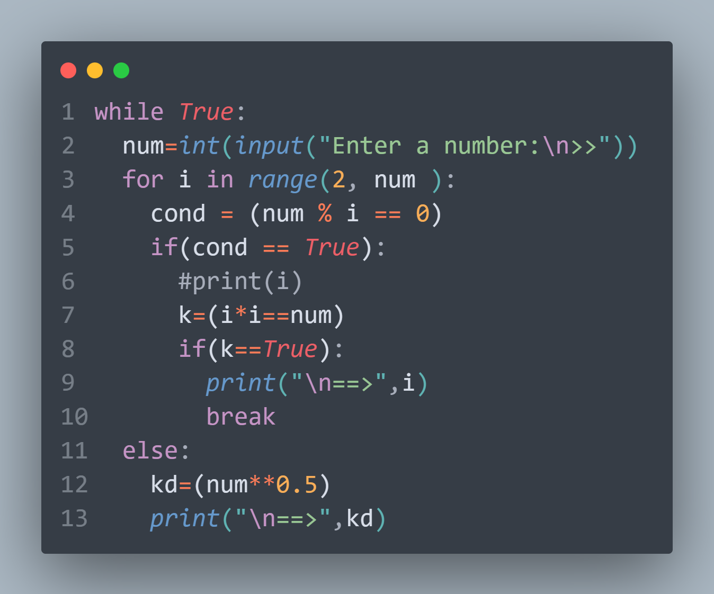
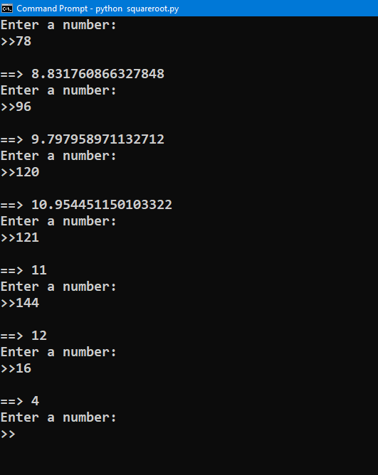

<h1 align="center">
   
  <b><i>#PYTHON ==> Find-Square-Root-of-number</i></b>
</h1>

<h2>
  <i>
 

🚀 #You can Download, the 👆 FILE uploaded (squareroot.py) and run it, you will get the same #OUTPUT 🚀

</i>
</h2> 
